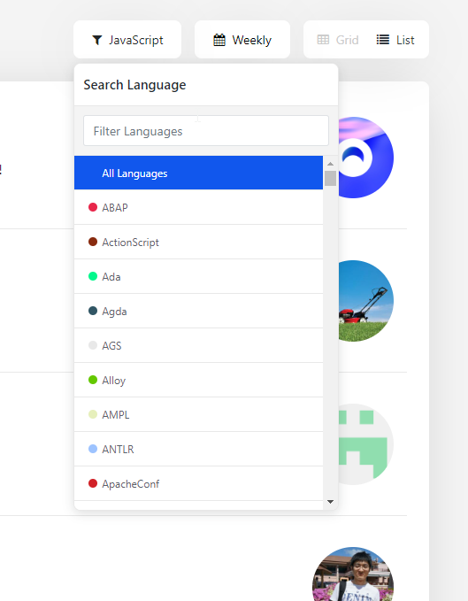

<h1 align="center">
  	   StarGaze
</h1>

  
  

  <b>Explore the most starred projects on GitHub</b> 
  ✨ React app to go through the top projects ✨

   <b>StarGaze</b> is a react application  that lets you explore
   the most starred projects on GitHub <a href="https://stargaze-jamestsetsekas.vercel.app/">Use Online</a>
    
  <b>Weekly Trending Projects – List View</b> 
  💥 Keep Scrolling to load past weeks 💥

  
  <b>Weekly Trending Projects – Grid View</b> 
  💥 Change the view options from the filters list 💥

   
  <b>Filter by Language</b> 
  💥 Will remember your selection of language 💥

## Installation

- Use Online – https://stargaze-jamestsetsekas.vercel.app/

## Contributions

- Spread the word
- Open pull requests
- Reach out with any feedback 

## License

MIT © [James Tsetsekas]
